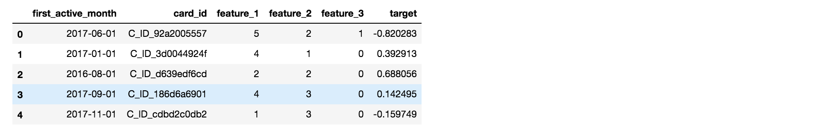
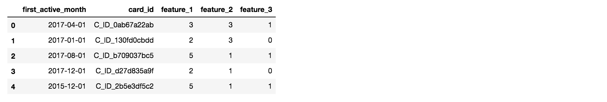
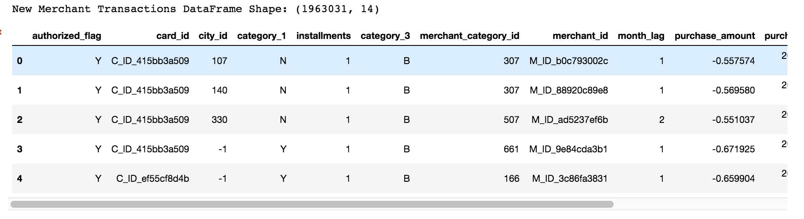
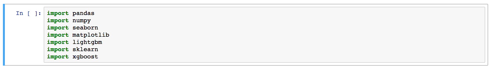
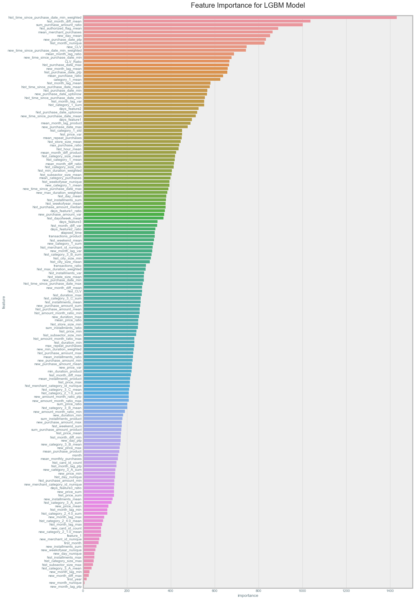
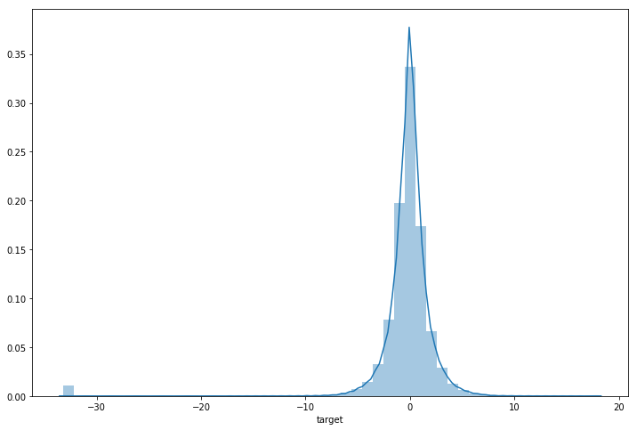
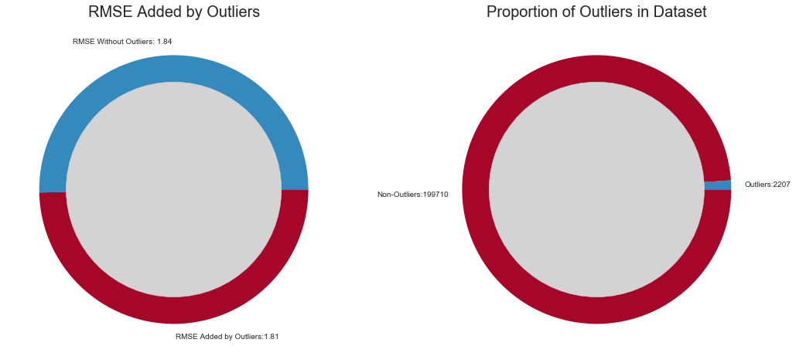

# ELO Merchant Category Recommendation

"Elo has built machine learning models to understand the most important aspects and preferences in their customers’ lifecycle, from food to shopping. But so far none of them is specifically tailored for an individual or profile. This is where you come in.

In this competition, Kagglers will develop algorithms to identify and serve the most relevant opportunities to individuals, by uncovering signal in customer loyalty. Your input will improve customers’ lives and help Elo reduce unwanted campaigns, to create the right experience for customers." [1]

This repo covers the entire pipeline of my solution to the ELO Merchant Category Recommendation challenge hosted by ELO on kaggle. The solution is split into five parts:

**1. Exploratory Data Analysis**

**2. Data Preprocessing**

**3. Feature Engineering**

**4. Feature Selection**

**5. Final Model(s)**

Ultimately this solution placed 108th/4000 putting it in the top 3% of solutions.

## Dataset

The dataset consists largely of past customer transactions and other tabular features. The data set is available publically at:

[1] https://www.kaggle.com/c/elo-merchant-category-recommendation

The data set is split into the following files:

**train.csv**: Tabular features and loyalty scores for a set of card_ids.

**test.csv**: Same as test without loyalty scores for different card_ids.

**historical_transactions.csv**: ~1GB of past customer transactions with at least three months of data for every cardid in the data set.

**new_merchant_transactions.csv**: ~20mb of data for two months worth of purchases made at merchant_ids that were not visited in the historical dataset (same features as historical_transactions.csv)

## Packages

This project is executed entirely in python and requires the following packages in order to run:

## Summary

The most effective method for improving model predictions was to add aggregate features from the  **historical_transactions.csv** and **new_merchant_transactions.csv** files. Things like knowing the average month a customers purchases were centered around, when the customer made their first purchase, and how many times customers made the same purchases were all very useful for making effective predictions. Below is a full list of features as well as their corresponding feature importance (gain importance) from the best single model (a LightGBM).

Another major theme of this project was determing an effective method for dealing with outliers. Looking at the target distribution it can be observed that some values were well outside of the expected distribution.

These outliers made up a tiny proportion of the data set but because the competition was evaluated using a mean squared error they made up a significant portion of the total loss for each model. 

Models were therefor created to identify these outliers and utilized in the final ensembles.

The most effective models for this task were found to be gradient boosted trees. Specifically LightGBM performed better than XGboost or conventional boosting. The final model was an ensemble of LightGBMs trained at varying depths with some trained to predict target values and others trained to predict outliers.

## Results

The best single model would place in the top 5%, while the final ensemble of varying depth lgbm,xgboost and lgb outlier classifiers places in the top 3%. The final position of the model is 108/4129.
